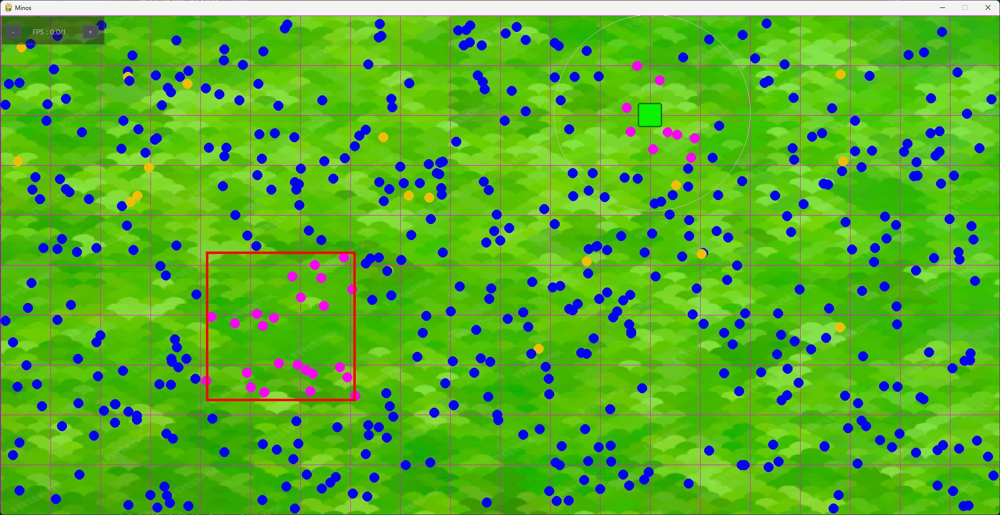

Les **Minos** sont le coeur de la simulation. Vous trouverez ici les détails techniques qui complètent la partie [Explication des Minos](../Explication/minos.md).

Un Minos est une entité à la fois simple et complexe qui suit des règles précises. Ces entités sont implémentées avec la classe `Mino` et gérées avec l'`Engine`.

### Paramètre principaux de la classe Mino :
| Catégorie                     | Attribut                  | Description                                                                                                                        |
| :---------------------------- | :------------------------ | :--------------------------------------------------------------------------------------------------------------------------------- |
| **Génétique**                 | `resistance`              | Résistance du Minos (max entre 0.1 et la loi normale passée en paramètre)                                                          |
|                               | `vitesse`                 | Vitesse du Minos (max entre 0.2 et la loi normale passée en paramètre)                                                             |
|                               | `vision`                  | Vision du Minos (max entre 0.1 et la loi normale passée en paramètre)                                                              |
|                               | `satiete`                 | Satiété du Minos (max entre 30 et la loi normale passée en paramètre)                                                              |
| **Etats du Minos**            | `jauge_faim`              | Jauge de faim du Minos                                                                                                             |
|                               | `mort` / `to_clear`       | Etat du Minos                                                                                                                      |
|                               | `sprint`                  | Etat de sprint                                                                                                                     |
| **Navigation et percception** | `destination_food`        | Nourriture où aller                                                                                                                |
|                               | `x` et `y`                | Coordonnées du Minos                                                                                                               |
|                               | `draw_vision`             | Afficher le cercle de vision ou non                                                                                                |
|                               | `food_list`               | Liste de toutes les nourritures sur la carte (utilisé rarement si il ne trouve pas de nourriture dans  `food_list_to_see_before `) |
|                               | `food_list_to_see_before` | Liste de toutes les nourritures qui partagent les mêmes cases de la grille                                                         |
| **Statistiques**              | `time_lived`              | Le temps total vécu                                                                                                                |
|                               | `food_eaten`              | Le nombre de nourriture mangées                                                                                                    |
|                               | `distance_traveled`       | Distance totale parcouru                                                                                                           |


## Fonctionnement
Un Minos fonctionne grâce à une fonction principale `update` où `update_speed` pour la version sans interface.

Ces fonctions sont séparées en 2 : 

- Si le Minos est en vie : 
    -  Actualise le nombe de frame(`time_lived`), la liste de nourriture (`food_list`) et la liste de nourriture à portée (`food_list_to_see_before `)
    - Vérifie le mode de sprint
    - Déplace le Minos
    - Actualise la jauge de faim
    - Vérifie si il mange 
- Sinon  : 
    - Change progressivement sa couleur vers le noir
  
Voici comment un Minos gère ses destination et ses déplacements. (Petite appartée ici, je rappelle que ces fonctions sont entièrement réfléchie et programmées par moi. Ce n'est donc sans doute pas la meilleur manière de le faire mais cela m'a fait m'exercer). 

La méthode `find_destination` est appelée toute les 10 frames ou lorsqu'un Minos a atteind sa destination. On vérifie d'abord si il n'y a pas de nourriture dans le voisinnage, si non, on regarde toute les nourritures de la carte. Cela se fait grâce à la méthode `get_closer_food` : 
    
```python

    def get_closer_food(self, list_to_search):
        dist_min = float("inf") #(1)
        x_to_go = None #(2)
        for f in list_to_search: #(3)
            if not f.to_destroy: #(4)
                if self.jauge_faim > self.max_jauge_faim *0.2: #(5)
                    if f.in_zone: #(6)
                        dx = f.x - self.x
                        dy = f.y - self.y
                        dist_min = dx*dx + dy*dy #(7)
                        x_to_go = f.x
                        y_to_go = f.y
                        food = f
                        break

                dx = f.x - self.x
                dy = f.y - self.y
                distance_sq = dx*dx + dy*dy #(7)
                if distance_sq < dist_min: 
                    dist_min = distance_sq
                    x_to_go = f.x
                    y_to_go = f.y
                    food = f
        if x_to_go == None:
            return -1,-1,-1,None #(8)
        return math.sqrt(dist_min), x_to_go, y_to_go, food #(9)
```

1. le plus petit float représentable
2. Pour savoir si le Minos a trouvé une destination
3. Parcourt toute les nourriture de la liste
4. Si elle n'est pas à détruire
5. Il regarde que quand il a 20% de sa vie, sinon il se concentre sur celles autours de lui
6. Si il voit une nourriture dans une zone d'abondance, il abandonne les recherche et s'y dirige
7. Calcul sans racine carré car moins gourmand
8. Convention : on retourne cela si il n'a pas trouvé de destination
9. On retourne les valeurs trouvées et la vraie distance

   
!!! info "Optimisation des recherches"
    Afin d'optimiser les recherches de nourriture qui peuvent être couteuse lorsqu'il y en a beaucoup, la distance est calculée uniquement à la fin car l'opération racine carré est plutot gourmande. Aussi, le Minos se comparera uniquement aux nourritures proches de lui et à celle de la zone de densité. 



*Visualisation en rose des nourritures qui sont prise en compte par le Minos*