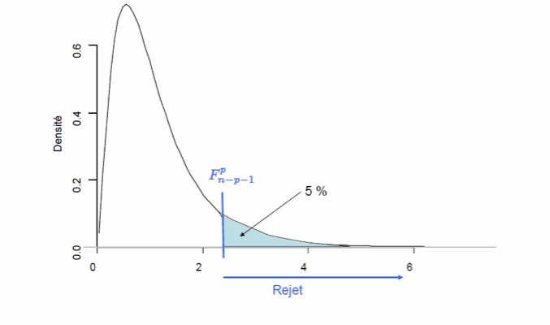
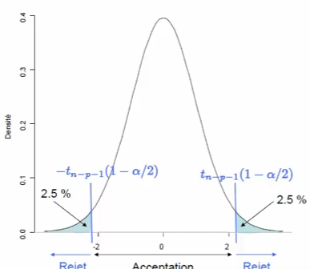

# Machine Learning

Ici, vous trouverez un "journal de bord" des principales étapes de la création de mon modèle de Machine Learning. (Cette page me servira de mémento aussi).

D'abord, j'ai créé une nouvelle branche sur GitHub intitulée "V3-ML". Cette branche aura moins d'interface et sera moins "user-friendly" que les autres versions. Cela se déroulera principalement dans la console où l'utilisateur aura le choix de comment remplir ses données. Il pourra choisir l'espérance et la variance de ses attributs. Il pourra aussi choisir le nombre de fois que toutes les simulations vont se répéter pour des données plus solides. Une fois cela fait, le modèle de ML lui dira quels sont les gènes les plus importants dans une simulation pauvre, une simulation équilibrée et une simulation riche (qui seront déjà définies). Le modèle sera capable de prédire sur ces données un échantillon de Minos qui sont susceptibles de survivre le plus longtemps. Enfin, l'utilisateur aura la possibilité de regarder X simulations où les Minos susceptibles de survivre auront un marquage.


## Documentation

Pour cet apprentissage, j'ai utilisé les cours de François Husson, enseignant chercheur en statistiques. 
- https://www.youtube.com/watch?v=CCzGRyO2CTc

## Plan d'action

Après des recherches, j'ai trouvé que le modèle de ML qui conviendrait à mon projet et pas trop difficile à prendre en main est le modèle de régression linéaire multiple. Ici, pas de réseaux de neurones difficiles, on commence par les bases.

### 1. Préparation et normalisation

A la différence des rendu visuels, ici on essaie d'utiliser uniquement les donnnées parlantes. Je garde donc uniquement le génome et le temps de survie des Minos. 
Je me suis rendu compte que ces données n'étaient pas normalisées. J'ai donc décider de les borner entre 0 et 1 mais c'était difficile car je ne pouvais pas connaitre le maximum ni le minimum à chaque simulation. J'ai donc fais le choix de les normaliser selon un écart à la moyenne ($\mu$ que je connais) avec la formule $z = \frac{x - \mu}{\sigma}$


## Notes de cours

Vous trouverez ici les notes que j'ai prise du cours de François Husson. Tout ce qui est écrit ici est compris et maitrisé.  

Ici, l'objectif est d'expliquer quels gènes ont un rôle important et de prédire le temps de vie d'un Minos en fonction de ses gènes.

- "Expliquer une variable quantitative Y en fonction de p variables quantitatives $x_1, \ldots, x_p$"
- "Prédire de nouvelles valeurs pour Y"

### Formule régression simple

Pour tout $i$ de $1$ à $n$ :

$$Y_i = \beta_0 + \beta_1 x_i + \varepsilon_i$$

avec $\varepsilon_i$ iid, $\mathbb{E}(\varepsilon_i) = 0$, $\mathbb{V}(\varepsilon_i) = \sigma^2$

$\varepsilon_i$ correspond à :

- erreur de mesure
- erreur d'échantillonnage
- facteur mal contrôlé (une valeur de x mal mesurée)
- oubli de facteur

**Solution :** introduction de variables supplémentaires pour réduire cette variabilité résiduelle (mieux expliquer Y)

### Définition du modèle de régression multiple

Expliquer une variable réponse Y en fonction de p variables explicatives $x_1, x_2, \ldots, x_p$

Pour tout $i$ de $1$ à $n$ :

$$Y_i = \beta_0 + \beta_1 x_{i1} + \cdots + \beta_j x_{ij} + \cdots + \beta_p x_{ip} + \varepsilon_i$$

avec $\varepsilon_i$ iid, $\mathbb{E}(\varepsilon_i) = 0$, $\mathbb{V}(\varepsilon_i) = \sigma^2$

Ici, les xi sont nos variables observées : resistance, vitesse, satiété etc...
Y représente le temps de vie du Minos

Le modèle traduit l'influence de chaque variable sur Y :

- **Linéarité du modèle :** linéarité par rapport aux paramètres
- **Additivité :** les effets des variables s'additionnent
- **Modèle polynomial possible :** $Y_i = \beta_0 + \beta_1 x_{i1} + \beta_2 x_i^2 + \varepsilon_i$ (important pour ne pas étudier que les effets linéaires)

#### Système matriciel

$$\begin{aligned}
Y_1 &= \beta_0 + \beta_1 x_{11} + \cdots + \beta_j x_{1j} + \cdots + \beta_p x_{1p} + \varepsilon_1 \\
\vdots & \quad \vdots \\
Y_i &= \beta_0 + \beta_1 x_{i1} + \cdots + \beta_j x_{ij} + \cdots + \beta_p x_{ip} + \varepsilon_i \\
\vdots & \quad \vdots \\
Y_n &= \beta_0 + \beta_1 x_{n1} + \cdots + \beta_j x_{nj} + \cdots + \beta_p x_{np} + \varepsilon_n
\end{aligned}$$

#### Notation matricielle

$$Y = X\beta + E \quad \text{avec } \mathbb{E}(E) = 0, \quad \mathbb{V}(E) = \sigma^2 I_d$$

La réalité (Y) est égale à la prédiction (X$\beta$) PLUS un aléa qui n'est pas maîtrisable ($\varepsilon$). 
Cet epsilon représente à la fois une erreur du modèle (mauvais Beta) et une erreur du monde (le minos a eu de la chance)

$$\begin{bmatrix}
Y_1 \\
\vdots \\
Y_i \\
\vdots \\
Y_n
\end{bmatrix}
=
\begin{bmatrix}
1 & x_{11} & \cdots & x_{1j} & \cdots & x_{1p} \\
\vdots & \vdots & & \vdots & & \vdots \\
1 & x_{i1} & & x_{ij} & & x_{ip} \\
\vdots & \vdots & & \vdots & & \vdots \\
1 & x_{n1} & \cdots & x_{nj} & \cdots & x_{np}
\end{bmatrix}
\begin{bmatrix}
\beta_0 \\
\beta_1 \\
\vdots \\
\beta_j \\
\vdots \\
\beta_p
\end{bmatrix}
+
\begin{bmatrix}
\varepsilon_1 \\
\vdots \\
\varepsilon_i \\
\vdots \\
\varepsilon_n
\end{bmatrix}$$

L'objectif est donc d'estimer tous les coefficients $\beta_i$ (le vecteur $\beta$).

## Estimation des paramètres du modèle

Pour estimer les paramètres $\beta$, on va chercher à minimiser l'écart entre une observation et la prévision par le modèle (le tout au carré) :

$$\begin{aligned}
\hat{\beta} &= \underset{\beta_0, \ldots, \beta_p}{\min} \sum_{i=1}^{n} \left( y_i - (\beta_0 + \beta_1 x_{i1} + \cdots + \beta_p x_{ip}) \right)^2 \\
&= \underset{\beta}{\arg\min} \, \| Y - X\beta \|^2 \\
&= \underset{\beta}{\arg\min} \, (Y - X\beta)'(Y - X\beta)
\end{aligned}$$

Minimiser la norme en Y et X$\beta$. Il est possible de trouver les $\beta$ en minimisant cette quantité (dériver cette fonction et annuler la dérivée).

**Explication visuelle :**

On a le nuage de point (les minos), il faut tracer une droite qui passe au milieu, chaque mouvement de règle change les betas. Pour savoir si la règle est bien placée :

- mesurer la distance entre les points et la règle ($\varepsilon$)
- mettre ces distances au carré (les - deviennent +)
- On fait la somme

Le but est donc de minimiser cette quantité pour avoir la règle qui passe le plus près de tous les points.

### Dérivée matricielle par rapport à $\beta$

Règles de dérivation : $\frac{\partial(A'Z)}{\partial A} = \frac{\partial(Z'A)}{\partial A} = Z$

$$\begin{aligned}
0 &= \frac{\partial \| Y - X\beta \|^2}{\partial \beta} = \frac{\partial (Y - X\beta)'(Y - X\beta)}{\partial \beta} \\
&= \frac{\partial (Y'Y - Y'X\beta - \beta'X'Y + \beta'X'X\beta)}{\partial \beta} \\
&= -X'Y - X'Y + X'X\beta + X'X\beta \\
&\implies X'X\hat{\beta} = X'Y
\end{aligned}$$

$$\hat{\beta} = (X'X)^{-1}X'Y$$

où le ' désigne la transposée (on inverse les lignes et les colonnes de X).

Cette formule est un raccourci de la formule pour trouver $\hat{\beta}$ qui consistait à « brute force » pour trouver les $\beta$. Ici cette formule est compliquée et est toujours faite par un ordinateur.

$X'X$ est inversible quand on a plus de données que de paramètres à estimer ($n > p + 1$). La matrice est en général inversible.

### Propriétés

On veut que $\hat{\beta}$ soit sans biais (en moyenne on ne se trompe pas) :

$$\mathbb{E}(\hat{\beta}) = \beta, \quad \mathbb{V}(\hat{\beta}) = (X'X)^{-1}\sigma^2, \quad \mathbb{V}(\hat{\beta}_j) = [(X'X)^{-1}]_{jj} \sigma^2$$

Plus la variance est faible, plus l'estimation sera précise.

## Prédiction et résidus

### Valeurs prédites

$$\hat{y}_i = \hat{\beta}_0 + \hat{\beta}_1 x_{i1} + \cdots + \hat{\beta}_j x_{ij} + \cdots + \hat{\beta}_p x_{ip}$$

$\hat{y}_i$ la prévision du modèle pour un ensemble de valeur. À partir de toutes ces valeurs on peut prédire $\hat{y}_i$ à partir des coefficients qu'on a estimé.

### Résidus

$$e_i = y_i - \hat{y}_i$$

Écart entre l'observation et la prévision

### Estimateur de la variabilité résiduelle

$$\hat{\sigma}^2 = \frac{\sum_{i} (Y_i - \hat{Y}_i)^2}{n - p - 1} = \frac{\sum_{i} \varepsilon_i^2}{n - p - 1}$$

$n - p - 1$ = nombre de données - nombre de paramètre à estimer à partir des données

$$\mathbb{E}(\hat{\sigma}^2) = \sigma^2$$

$\Rightarrow$ l'estimateur est sans biais

### Décomposition de la variabilité

On va essayer de comprendre pourquoi les Y varient. Les Y sont les valeurs observées avec une certaine variabilité. On va chercher à comprendre cette variabilité et on va chercher à voir si notre modèle arrive à « comprendre » cette variabilité de Y.

$$\sum_{i} (y_i - \bar{y})^2 = \sum_{i} (\hat{y}_i - \bar{y})^2 + \sum_{i} (y_i - \hat{y}_i)^2$$

| Source Variation | Somme des carrés                   | ddl (deg de lib) | Carré Moyen                    |
| :--------------- | :--------------------------------- | :--------------- | :----------------------------- |
| Modèle           | $\sum_{i} (\hat{y}_i - \bar{y})^2$ | $p$              | $\frac{\text{SCM}}{p}$         |
| Résidu           | $\sum_{i} (y_i - \hat{y}_i)^2$     | $n - p - 1$      | $\frac{\text{SCR}}{n - p - 1}$ |
| Total            | $\sum_{i} (y_i - \bar{y})^2$       | $n - 1$          |                                |

Tableau d'analyse des variance.

### Coefficient de détermination

Coefficient utile pour savoir si le modèle est bon ou non (R²). Pourcentage de variabilité expliqué par le modèle :

$$R^2 = \frac{\text{SCmodèle}}{\text{SCtotal}} = 1 - \frac{\text{SCrésiduelle}}{\text{SCtotal}}$$

Plus R² est proche de 1, plus les prévisions du modèle sont proches des valeurs observées.

**Propriétés :**

- $0 \leq R^2 \leq 1$
- $R^2 = 0 \Leftrightarrow \text{SCmodèle} = 0$
- $R^2 = 1 \Leftrightarrow \text{SCmodèle} = \text{SCtotal}$

## Inférence : test global

Pour vérifier si R² est significatif (si le modèle est intéressant), on va construire un test. 

### Hypothèses

H0 : le modèle n'est pas intéressant $\Leftrightarrow R^2 = 0 \Leftrightarrow \beta_1 = \beta_2 = \ldots = \beta_p = 0$

H1 : le modèle est intéressant $\Leftrightarrow R^2 \neq 0 \Leftrightarrow \beta_1 \neq 0$ ou $\beta_2 \neq 0$ ou ... ou $\beta_p \neq 0$

### Sous H0

Si H0 est vrai :

$$\mathbb{E} \left( \frac{SC_M}{p} \right) = \mathbb{E}(CM_M) = \sigma^2$$

$$\mathbb{E} \left( \frac{SC_R}{n - p - 1} \right) = \mathbb{E}(CM_R) = \sigma^2$$

Si ces 2 quantités sont comparables, alors on est sous H0

**Principe du test :** faire un test de comparaison de variance

### Statistique de test

$$F_{obs} = \frac{SC_M / p}{SC_R / (n - p - 1)} = \frac{CM_M}{CM_R}$$

### Loi de la statistique de test

Sous $H_0$ : $\mathcal{L}(F_{obs}) = \mathcal{F}_{p}^{n-p-1}$

### Décision

$$F_{obs} > \mathcal{F}_{p}^{n-p-1}(1 - \alpha) \Longrightarrow \text{rejet de } H_0 \text{ au seuil } \alpha$$



Si la statistique de test est très grande (par exemple 10), il y a peu de chance qu'elle suive une loi de Fisher, on remet donc en cause H0 qui suit une loi de Fisher. À contrario, si la valeur n'est pas très grande, par exemple 1, alors l'hypothèse est acceptable, on accepte donc H0.

Si le modèle n'est pas intéressant, c'est que les variables explicatives ne sont pas intéressantes.

## Inférence : test d'un coefficient de régression

### Loi de l'estimateur

$$\mathcal{L}(\hat{\beta}_j) = \mathcal{N} \left( \beta_j, \sigma_{\hat{\beta}_j}^2 \right) \quad \text{avec} \quad \sigma_{\hat{\beta}_j}^2 = (X'X)^{-1}_{jj}$$

### Variable centrée réduite (cas où $\sigma$ est connu)

$$\mathcal{L} \left( \frac{\hat{\beta}_j - \beta_j}{\sigma_{\hat{\beta}_j}} \right) = \mathcal{N}(0, 1)$$

### Statistique de Student (cas où $\sigma$ est estimé)

$$\mathcal{L} \left( \frac{\hat{\beta}_j - \beta_j}{\hat{\sigma}_{\hat{\beta}_j}} \right) = \mathcal{T}_{n-p-1}$$

**Exemple :** Pour Beta1 sa loi est $\mathcal{N} \left( \beta_1, \sigma_{\hat{\beta}_1}^2 \right)$

Ensuite : on centre et on divise par l'écart type :

$$\mathcal{L} \left( \frac{\hat{\beta}_1 - \beta_1}{\sigma_{\hat{\beta}_1}} \right) = \mathcal{N}(0, 1)$$

Comme on ne connaît pas la valeur de $\sigma_{\hat{\beta}_1}$, on la remplace par son estimateur :

$$\mathcal{L} \left( \frac{\hat{\beta}_1 - \beta_1}{\hat{\sigma}_{\hat{\beta}_1}} \right) = \mathcal{T}_{n-p-1}$$

Grâce à cette loi, on peut construire des tests et des intervalles de confiance.

### Hypothèses

$H_0 : "\beta_j = 0"$ contre $H_1 : "\beta_j \neq 0"$

> $H_0$ : la variable $j$ n'apporte pas d'information supplémentaire intéressante sachant que les autres variables sont déjà dans le modèle.

### Statistique de test

$$T_{obs} = \frac{\hat{\beta}_j}{\hat{\sigma}_{\hat{\beta}_j}}$$

### Loi de la statistique de test sous $H_0$

$$\mathcal{L}(T_{obs}) = \mathcal{T}_{\nu=n-p-1}$$

### Décision

$$|T_{obs}| > t_{n-p-1}(1 - \alpha/2) \Longrightarrow \text{rejet de } H_0 \text{ au seuil } \alpha$$




# Création du modèle

Etonnamment, la création du modèle était beaucoup plus simple que de comprendre le fonctionnement.  
J'ai utilisé les bibliothèque numpy et pandas pour manipuler les matrices. 

```python

    df = pd.read_csv("data.csv")
    df["vitesse2"] = df["vitesse"]**2 #Car ici on sait que le temps de survie en fonction de la vitesse a une forme de cloche.  
    df["un"] = 1 # Colonne qui représente les Beta0 (temps de survie si tout les autres Betas sont à 0)

    matrix_Y = df["time_lived"].to_numpy() #Matrice Y à prédire


    matrix_X = df[["un", "resistance", "vitesse", "vitesse2", "satiete", "vision"]].to_numpy() #Matrice X, nos observations


    # Beta_chapeau = (X'X^-1)X'Y
    matric_X_transpose = matrix_X.transpose()
    matrix_X_produit_transpose = np.dot(matric_X_transpose, matrix_X)
    matrix_X_produit_transpose_invert = np.linalg.inv(matrix_X_produit_transpose)
    matrix_X__before_final = np.dot(matrix_X_produit_transpose_invert, matric_X_transpose)
    coef_beta = np.dot(matrix_X__before_final, matrix_Y) #Ici, on a donc les coefficients Beta. Il reste à vérifier si ils sont fiable
    
    
    
    y_chapeau = np.dot(matrix_X, coef_beta) # Notre estimation des temps de survie

    residus = y_chapeau - matrix_Y # L'erreur de notre modèle

    estimateur_variabilite_residuelle = np.mean((matrix_Y - y_chapeau)**2) #Erreur total du modèle 

    estimateur_variabilite_naturel = np.mean((matrix_Y - np.mean(matrix_Y))**2) # Variabilité naturelle de la simulation (aléatoire)

    coefficient_determination = 1 - estimateur_variabilite_residuelle/estimateur_variabilite_naturel # R², explique à quel point la matrice X impacte la matrice Y (est ce que les gènes sont important pour la survie)

    variance_erreur = np.sum((matrix_Y - y_chapeau)**2)/(len(matrix_Y) - 6) #volume de hasard. Plus il est grand, plus c'est imprévisible

    matrice_variance_covariance = matrix_X_produit_transpose_invert * variance_erreur #indique si les Beta risquent de changer si je relance une simulation

    ecart_type_gene = np.sqrt(np.diag(matrice_variance_covariance)) #Marge d'erreur pour chaque gène. Plus il est gros pour chaque gène, moins il est solide

    t_stat =  coef_beta/ecart_type_gene #La solidité de nos estimations, plus ils sont haut, plus le Beta_chapeau est fiable. 
```

