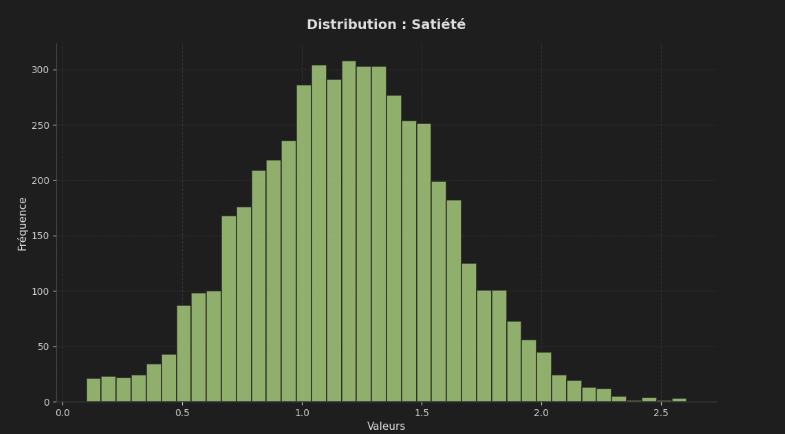
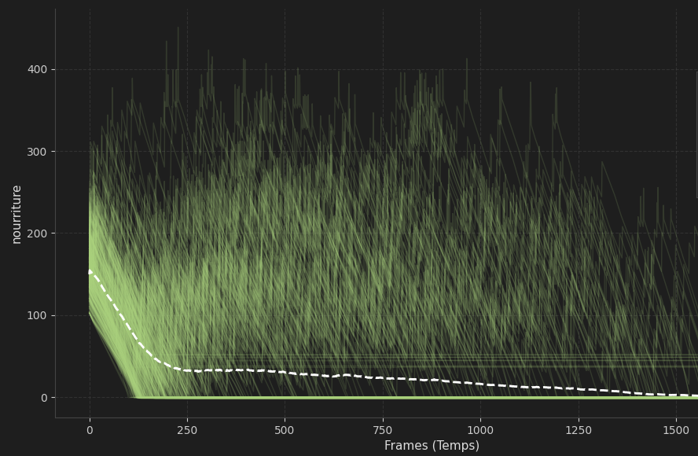
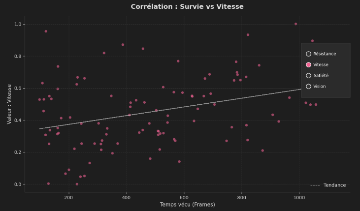
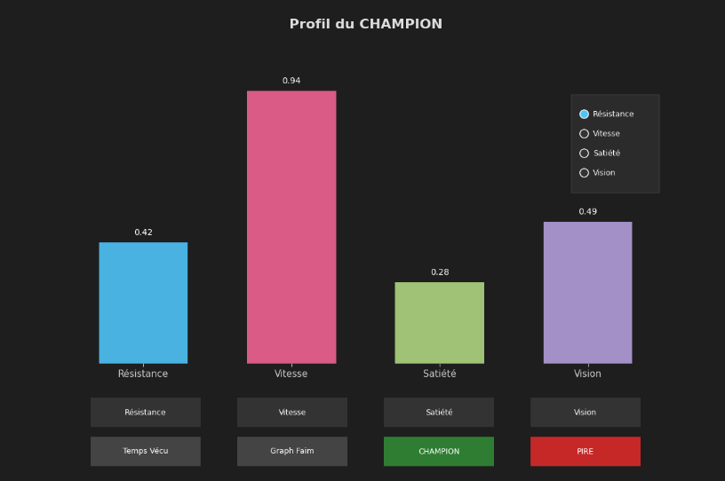

# Analyse et statistiques

Le projet LifeSim intègre un système de récolte de données, conçu pour le moment pour l'analyse scientifique de la survie et l'entrainement de modèles de Machine Learning.

## Mode simulation simple :

En mode unique, la priorité est la visualisation immédiate des données. 

### Collecte des données

Pendant que la simulation tourne, les données sont accumulées en mémoire puis structurées via **Pandas** et **Numpy**.

| Type               | Données                                   | Utilité                                                     |
| :----------------- | :---------------------------------------- | :---------------------------------------------------------- |
| Profil génétique   | Résistance, Vitesse, Satiété, Vision      | Voir la répartition des attributs et identifier les profils |
| Activité physique  | Distance parcourue, nourriture mangée     | Représenter l'efficacité énergétique                        |
| Comportement       | temps passé en zone d'abondance           | Voir si c'est une feature importante                        |
| Dynamique internes | évolution de la jauge de faim, temps vécu | Identifier les points fort de la vie d'un Minos             |

### Rendu visuel
A la fermeture de la fenêtre, le système génère automatiquement des graphiques 
Voici quelques exemples : 

*Distribution de la satiété sur 5000 Minos*

*Evolution de la faim de 1000 Minos*

*Corrélation entre la vitesse et le temps de survie*

*Profil du Minos qui a survécu le plus longtemps*

## Mode simulation multiples : 

En mode multiple, le but est de génerer des Datasets massifs. Chaque simulation vient nourrire une base de données globale au format CSV.

### Structure du fichier CSV
Chaque ligne réprésente toutes les informations d'un Minos.
    
| id   | resistance | vitesse | satiete | vision | time_lived | food_eaten | distance_traveled | nb_minos | ratio_food |
| :--- | :--------- | :------ | :------ | :----- | :--------- | :--------- | :---------------- | :------- | :--------- |
| 38   | 2.07       | 3.71    | 0.73    | 381.83 | 123        | 0          | 717.12            | 41       | 0.04       |
| 39   | 0.98       | 4.77    | 1.08    | 286.27 | 125        | 0          | 831.21            | 41       | 0.04       |
| 40   | 0.43       | 8.32    | 1.32    | 264.33 | 117        | 0          | 1665.8            | 41       | 0.04       |

!!! abstract "Exploitation Data"
    Ces lignes de données isolent chaque individu dans son contexte (nombre de concurrents, abondance de nourriture), offrant une vision complète et détaillée de la sélection naturelle simulée.

### Potentiel pour Machine Learning

Ces lignes permettent d'isoler chaque Minos et de comprendre dans quel cas il survit bien. Ces données sont idéales pour des algorithmes de Machin Learning 
