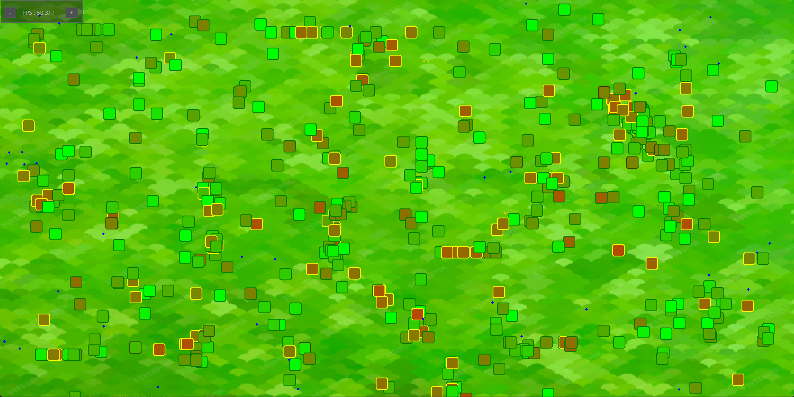

# LifeSim 

Bienvenue dans la documentation du projet **LifeSim**. Ce projet explore les mécanismes de la sélection naturelle via des simulations. 

## Présentation du projet

Le projet **LifeSim** est un moteur de simulation 2D développé en Python. Il met en scène des entités biologiques appelées "Minos" qui doivent survivre dans un environnement aux ressources limitées.
Chaque individu possède son propre patrimoine génétique qui influence son comportement et sa survie : certains seront rapides et gourmand, d'autres lents mais économe.

## Objectif des simulations : 
1. **Survie** : Permettre au Minos de survivre dans un environnement équilibré
2. **Sélection** : Observer quels traits génétiques favorisent la longévité dans différents scénario
3. **Analyse** : Récolte des données massives pour l'étude statistique et le Machine Learning

---

## A propos du projet

Ce projet a été réalisé autonomie totale parallèlement à mes études. L'intégralité du moteur de survie, du système de collecte de données et prochainement du modèle de ML a été développé **"from scratch"** sans aide d'intelligence artificielle (mise à part pour la syntaxe).

!!! tip "Pourquoi ce projet ?"

     - **Défi personnel** : Développer une simulation complète sans aide d'IA m'a permis de tester mes compétences en algorithmique 
     - **Gestion de projet** : Apprendre à structurer un projet complet du cahier des charges à la documentation en passant par l'optimisation
     - **Intérêt pour la donnée** : Pouvoir lier développement logiciel et l'analyse de données 
     - **Initiation au ML** : Pouvoir apprendre la maitrise du ML **from scratch** sur un projet concret

---

## Futures évolutions

Ce projet est amené à évoluer vers deux axes distincts :

- **Sélection naturelle** :
    - **Reproduction** : A la fin de chaque cycle, les Minos les plus performant se reproduiront
    - **Mutation** : Introduction de légère variation aléatoire des gènes.
- **Prédiction du survivant** : 
    - **Modélisation** : Création et entrainement d'un modèle de Machine Learning
    - **Prédiction** : Le modèle sera capable de prédir quel individu a le plus de chance de survivre en fonction de son ADN initial

